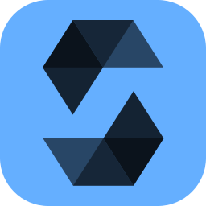
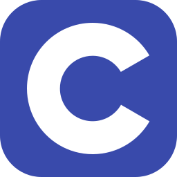
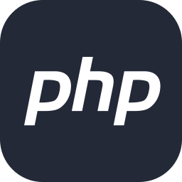
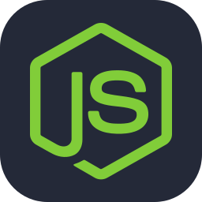
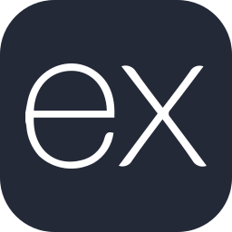
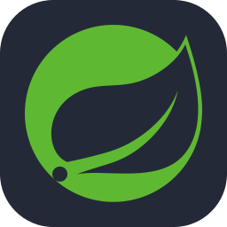
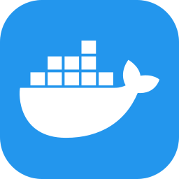
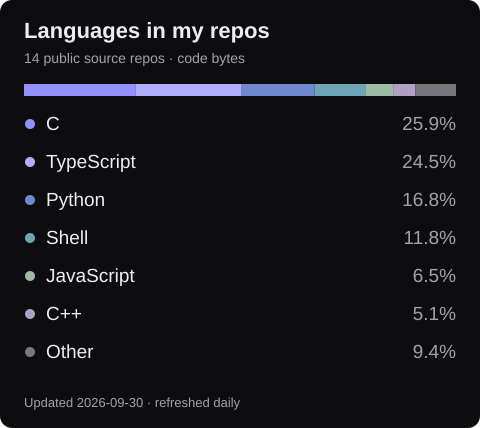

<a href="https://www.melik.dev/"><picture><source media="(max-width: 600px)" srcset="assets/profile-hero-mobile.svg"></picture></a>

I build apps, smart contracts and things that see. Usually moving between TypeScript, Solidity and Python — with some C, C++ and Java along the way.

[Website](https://www.melik.dev/) · [LinkedIn](https://www.linkedin.com/in/melik-ahmet-caymazo%C4%9Flu-42a136254/) · [Say hello](mailto:melikcaymaz@gmail.com)

## My toolbox

**Languages**

        

TypeScript · JavaScript · Python · Solidity · C · C++ · Java · PHP · Swift

**Apps & APIs**

    

React / React Native · Next.js · Node.js · Express · Spring Boot

**Data & tools**

    

PostgreSQL · MongoDB · Docker · Git · Linux

## In the code

Personal public repos only. Forks, this profile, markup, stylesheets and build/document formats are excluded. Team projects and private work aren't represented. Code volume, not proficiency.

## A few things I've built

- [ChronoTrade](https://github.com/GTU-Blockchain/chronotrade-ethglobal-prague) — trade skills for time. Blockscout prize at ETHGlobal Prague.
- [BitBrawlers](https://github.com/GTU-Blockchain/bitbrawlers-ethrome-2025) — NFT cats that battle on-chain. ENS prize at ETHRome.
- [PPE detection](https://github.com/melik-droid/ceng-mod01-ppe-detection) — computer vision on a Raspberry Pi safety robot.
- [Obscura](https://github.com/GTU-Blockchain/obscura-monad-blitz-istanbul) — anonymous votes and sealed bids on Monad.

More projects and the longer story at **[melik.dev](https://www.melik.dev/)**.
