<a href="https://www.melik.dev/"><picture><source media="(max-width: 600px)" srcset="assets/profile-hero-mobile.svg"></picture></a>

<picture><source media="(max-width: 600px)" srcset="assets/ticker-mobile.svg"></picture>


I build apps, smart contracts and things that see. Usually moving between TypeScript, Solidity and Python — with some C, C++ and Java along the way.

<a href="https://www.melik.dev/">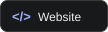</a> <a href="https://www.linkedin.com/in/melik-ahmet-caymazo%C4%9Flu-42a136254/">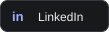</a> <a href="mailto:melikcaymaz@gmail.com">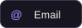</a>

##  Now

 <a href="https://www.last.fm/user/melik_cymz">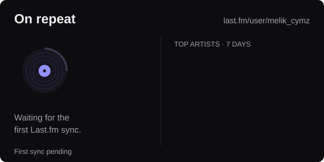</a>

<table>
<tr>
<td valign="top" width="50%">

### 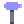 Things I've built

 **[ChronoTrade](https://github.com/GTU-Blockchain/chronotrade-ethglobal-prague)** — trade skills for time 
 Blockscout prize · ETHGlobal Prague 2025

 **[BitBrawlers](https://github.com/GTU-Blockchain/bitbrawlers-ethrome-2025)** — NFT cats that battle on-chain 
 ENS track prize · ETHRome 2025

 **[Obscura](https://github.com/GTU-Blockchain/obscura-monad-blitz-istanbul)** — anonymous votes and sealed bids 
Monad Blitz Istanbul 2025

 **[PPE detection](https://github.com/melik-droid/ceng-mod01-ppe-detection)** — YOLOv8 on a Raspberry Pi safety robot 
Computer vision · Python

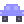 **[PayTak](https://github.com/PayTak-Org/PayTak-App)** — ride sharing with staked payments 
React Native · Express · Solidity

</td>
<td valign="top" width="50%">

###  Experience

 **Software Team Vice President** 
GTU Blockchain Society · 2024 – now 
Leading the software team, running workshops and mentoring members.

 **Computer Engineering Intern** 
XON Technology · Jul – Aug 2026 
PHP integration nodes for the PUQ AI platform and a Bayesian symptom-checking engine.

 **Part-time Full-stack Developer** 
Racfathers · Jun 2025 – Feb 2026 
Web3 applications with React, Express, Prisma and PostgreSQL.

 **B.Sc. Computer Engineering** 
Gebze Technical University · 2022 – now

</td>
</tr>
</table>

More projects and the longer story at **[melik.dev](https://www.melik.dev/)**.

## 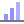 In the code

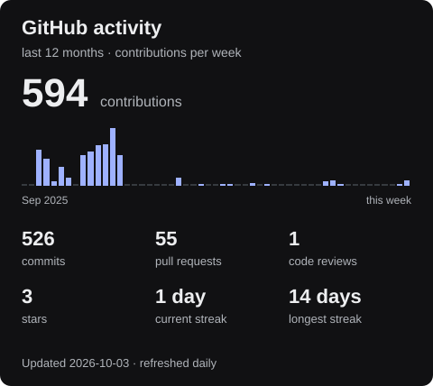 

<picture><source media="(prefers-color-scheme: dark)" srcset="https://raw.githubusercontent.com/melik-droid/melik-droid/output/snake-dark.svg"></picture>

Languages: personal public repos only. Forks, this profile, markup, stylesheets and build/document formats are excluded. Team projects and private work aren't represented. Code volume, not proficiency.

##  My toolbox

**Languages**

        

TypeScript · JavaScript · Python · Solidity · C · C++ · Java · PHP · Swift

**Apps & APIs**

    

React / React Native · Next.js · Node.js · Express · Spring Boot

**Data & tools**

    

PostgreSQL · MongoDB · Docker · Git · Linux
